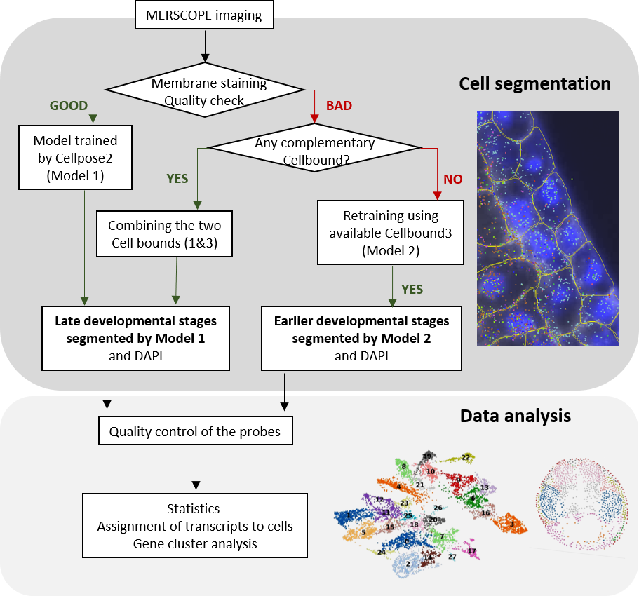

# Workflow for MERFISH spatial transcriptomics in Xenopus

This repository contains tutorials on segmentation of frog embryos for MERSCOPE spatial transcriptomics. 

Two custome Cellpose2 models trained for segmentation of cells from Xenopus.laevis are provided.  
Code and example data are provided in the tutorial.

The full process from sample preparation to data analysis for MERSCOPE is described in **"An optimized workflow for spatial transcriptomics across early development in Xenopus"**.

Citation: 
An optimized workflow for spatial transcriptomics across early development in Xenopus
Chenxi Zhou, Shubhamay Das, Thomas Defard, Kyra J. E. Borgman, Subham Seal, Vincent Kappès, Thomas Walter, Iva Simeonova, Geneviève Almouzni, Anne H. Monsoro-Burq
bioRxiv 2026.05.07.723548; doi: https://doi.org/10.64898/2026.05.07.723548

